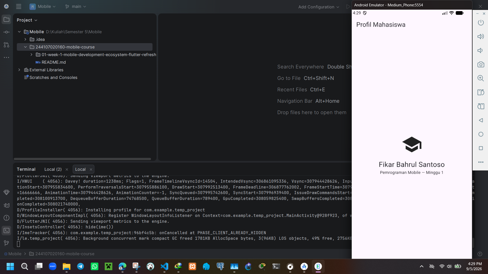

# Week 1 — Mobile Development Ecosystem & Flutter Refresh

| Identitas Mahasiswa | Keterangan |
|---|---|
| **Nama** | Fikar Bahrul Santoso |
| **NIM** | 244107020160 |
| **Mata Kuliah** | Pemrograman Mobile |

## Tentang Project

Project ini merupakan hasil praktikum minggu pertama Pemrograman Mobile menggunakan Flutter. Aplikasi dibuat dari project Flutter sederhana yang kemudian dimodifikasi menjadi halaman profil mahasiswa.

Pada praktikum ini, fokus utama adalah mengenal lingkungan pengembangan Flutter, melakukan setup Android SDK dan Emulator, serta membuat tampilan sederhana menggunakan widget.

## Fitur

Aplikasi menampilkan beberapa informasi dasar mahasiswa:

- Judul halaman **Profil Mahasiswa**
- Ikon Topi melambangkan pendidikan
- Nama mahasiswa
- NIM
- Informasi **Pemrograman Mobile — Minggu 1**
- Tampilan sederhana tanpa fitur counter bawaan Flutter

## Teknologi yang dipakai

| Teknologi | Penggunaan |
|---|---|
| Flutter | Framework aplikasi |
| Dart | Bahasa pemrograman |
| Visual Studio Code | Menulis dan mengedit kode |
| Android Studio | Android SDK dan Emulator |
| Git | Version control |

## Menjalankan Project

Pastikan Flutter dan Android Emulator sudah terpasang dan dapat digunakan.

Clone repository, kemudian masuk ke folder project:

```bash
git clone <repository-url>
cd <nama-folder-project>
```

Install dependency:

```bash
flutter pub get
```

Jalankan aplikasi:

```bash
flutter run
```

Aplikasi dapat dijalankan menggunakan Android Emulator atau perangkat Android yang terhubung.

## Kendala Setup

Saat melakukan setup, saya mengalami masalah pada bagian Android SDK dan Android License. Ketika menjalankan `flutter doctor`, muncul keterangan **Android license status unknown**. Artinya, Flutter sudah menemukan Android SDK, tetapi masih mengalami masalah dalam membaca atau memeriksa lisensi Android.

Saya kemudian mengecek kembali konfigurasi Android SDK dan menyesuaikan komponen SDK yang digunakan. Setelah konfigurasi diperbaiki, Flutter dapat mengenali Android SDK dan Android Emulator dengan normal sehingga project dapat dijalankan.

## Refleksi
**Kapan native lebih tepat dipilih daripada cross-platform?**<br>
Native lebih tepat dipilih kalau aplikasi membutuhkan fitur atau performa khusus dari satu jenis perangkat.

**Bagaimana perubahan state berhubungan dengan widget tree dan UI deklaratif?**<br>
Perubahan state akan membuat widget yang berkaitan diperbarui, sehingga tampilan UI ikut berubah sesuai kondisi terbaru.

**Mengapa commit kecil dengan pesan jelas bermanfaat bagi pekerjaan tim dan portfolio?**<br>
Commit kecil dengan pesan jelas memudahkan tim mengetahui perubahan dan membuat riwayat project lebih rapi untuk portfolio.
## Hasil Praktikum

Project berhasil dijalankan menggunakan Android Emulator dan aplikasi bawaan Flutter berhasil diubah menjadi halaman profil mahasiswa sesuai dengan kebutuhan praktikum.

Hot Reload digunakan untuk melihat perubahan kode secara cepat tanpa mengulang aplikasi dari awal, sehingga kondisi aplikasi biasanya tetap tersimpan.Sedangkan Hot Restart menjalankan aplikasi kembali dari awal banget,jadinya kondisi atau data sementara yang sebelumnya ada akan di-reset(ilang). Jadi, Hot Reload cocok untuk melihat perubahan kecil dengan cepat(sifat minor), sedangkan Hot Restart digunakan saat ingin memulai ulang aplikasi setelah melakukan perubahan kode(sifat major).

### Screenshot



## Kesimpulan

Pada praktikum minggu pertama, saya berhasil menyiapkan lingkungan Flutter, memperbaiki konfigurasi Android SDK, dan menjalankan aplikasi melalui Android Emulator. Project bawaan Flutter kemudian dimodifikasi menjadi aplikasi sederhana untuk menampilkan profil mahasiswa.