# Week 2 — Declarative UI & Responsive Design

| Identitas Mahasiswa | Keterangan |
|---|---|
| **Nama** | Fikar Bahrul Santoso |
| **NIM** | 244107020160 |
| **Mata Kuliah** | Pemrograman Mobile |

## Tentang Project

Project ini merupakan hasil praktikum minggu kedua Pemrograman Mobile menggunakan Flutter. Aplikasi dikembangkan menjadi dashboard akademik responsif dengan konsep declarative UI dan responsive design.

Pada praktikum ini, fokus utama adalah memahami penggunaan widget layout seperti `Row`, `Column`, `Expanded`, `Container`, serta menyesuaikan tampilan berdasarkan ukuran layar.

## Fitur

Aplikasi menampilkan beberapa informasi akademik:

- Header profil mahasiswa
- Halaman **Academic Overview**
- Minimal empat kartu informasi akademik
- Layout satu kolom pada layar sempit
- Layout dua kolom pada layar lebar
- Light theme dan dark theme
- Toggle untuk mengganti tema
- Label aksesibilitas menggunakan `Semantics`
- Widget reusable `InfoCard`
- Breakpoint responsive menggunakan konstanta `kWideBreakpoint`

## Teknologi yang Dipakai

| Teknologi | Penggunaan |
|---|---|
| Flutter | Framework aplikasi |
| Dart | Bahasa pemrograman |
| Visual Studio Code | Menulis dan mengedit kode |
| Android Studio | Android SDK dan Emulator |
| Git | Version control |

## Menjalankan Project

Pastikan Flutter dan Android Emulator sudah terpasang dan dapat digunakan.

Masuk ke folder project:

```bash
cd 02-week-2-declarative-ui-responsive-design
```

Install dependency:

```bash
flutter pub get
```

Jalankan aplikasi:

```bash
flutter run
```

## Praktikum 4 — Eksperimen Layout

Pada praktikum ini dilakukan pengamatan terhadap perubahan layout responsive.

1. Breakpoint `700` diubah ke nilai lain untuk mengamati perubahan jumlah kolom.
2. `themeMode` diuji menggunakan `ThemeMode.dark`, kemudian dikembalikan ke `ThemeMode.system`.
3. Aplikasi diuji pada ukuran layar emulator yang berbeda.
4. `Semantics` atau label bermakna ditambahkan pada elemen penting untuk membantu pengguna screen reader.

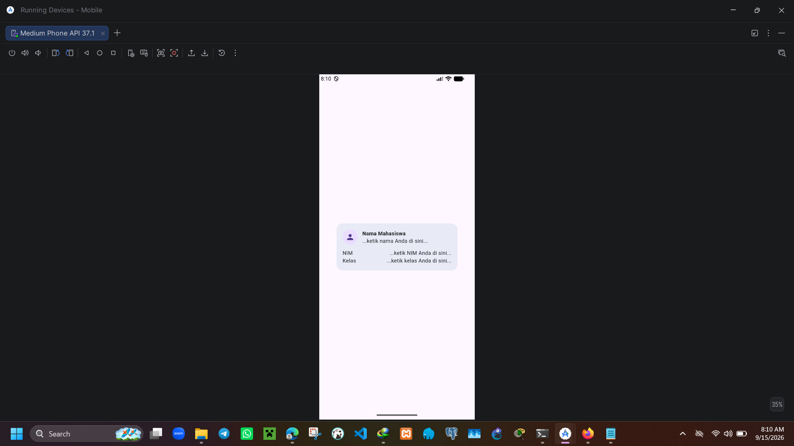

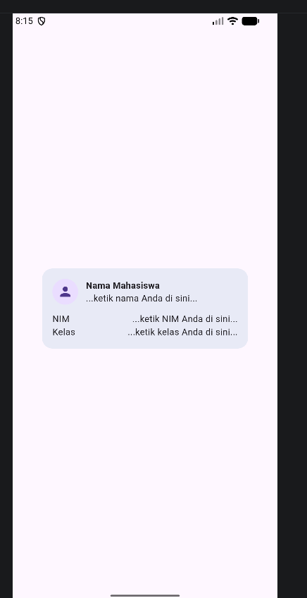

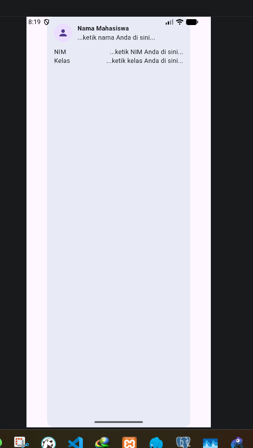

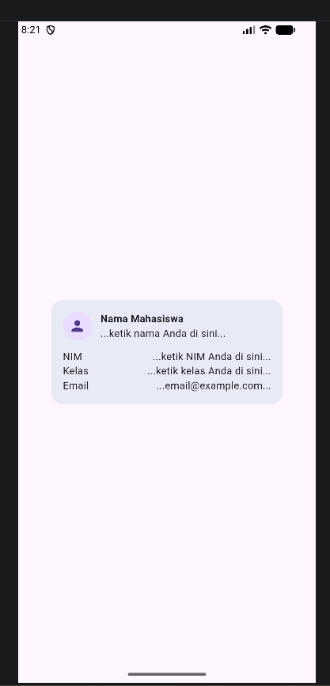

## Praktikum 5 — Eksperimen Warm-up

Pada praktikum ini dilakukan eksperimen terhadap perilaku widget layout Flutter.

1. `Expanded` pada baris nama dihapus untuk mengamati kemungkinan overflow.
2. `mainAxisSize: MainAxisSize.min` dibandingkan dengan nilai default.
3. Baris data tambahan seperti `Email` dibuat menggunakan pola `Row` dan `Expanded`.

### Screenshot

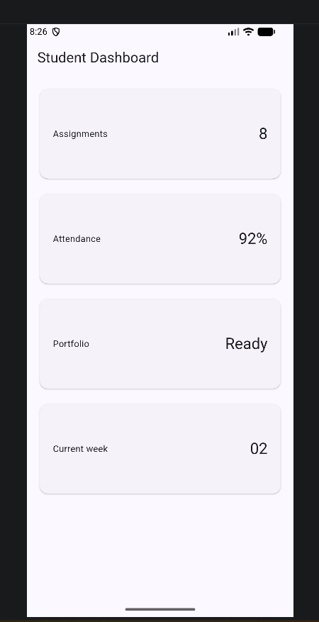

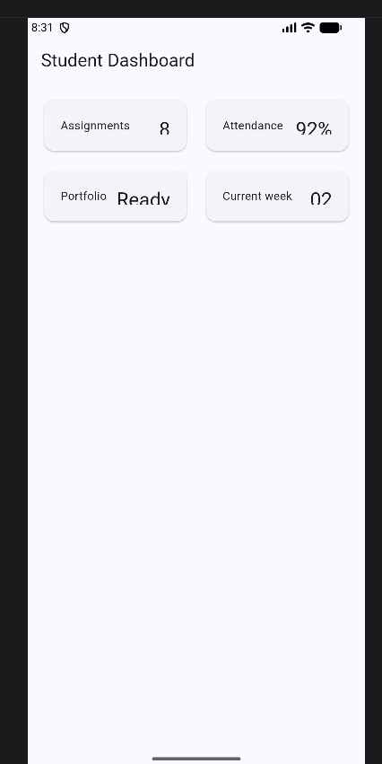

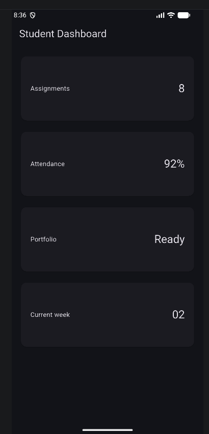

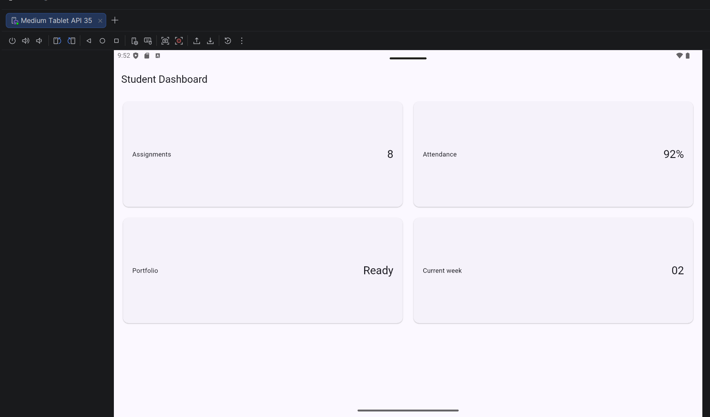

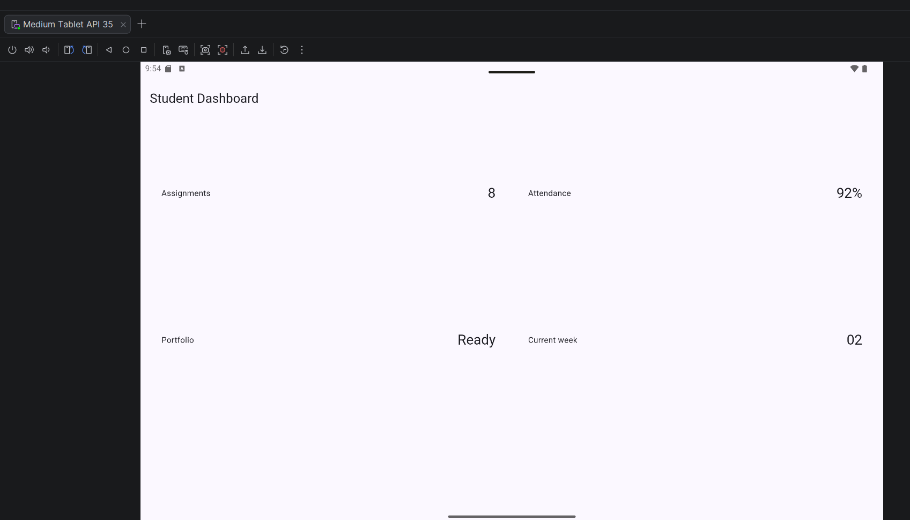

## Tugas Utama — Academic Overview

Dashboard dikembangkan menjadi halaman **Academic Overview** dengan ketentuan:

- Menggunakan `Row`, `Column`, `Expanded`, dan `Container`.
- Menampilkan satu kolom pada layar sempit.
- Menampilkan dua kolom pada layar lebar.
- Menyediakan light theme dan dark theme.
- Memiliki toggle tema menggunakan `Switch.adaptive`.
- Menyediakan label aksesibilitas pada informasi dan tombol penting.
- Menggunakan widget `InfoCard` yang reusable.

Breakpoint responsive didefinisikan satu kali:

```dart
const kWideBreakpoint = 700;
```

`LayoutBuilder` digunakan untuk menentukan jumlah kolom berdasarkan lebar layar.

### Screenshot

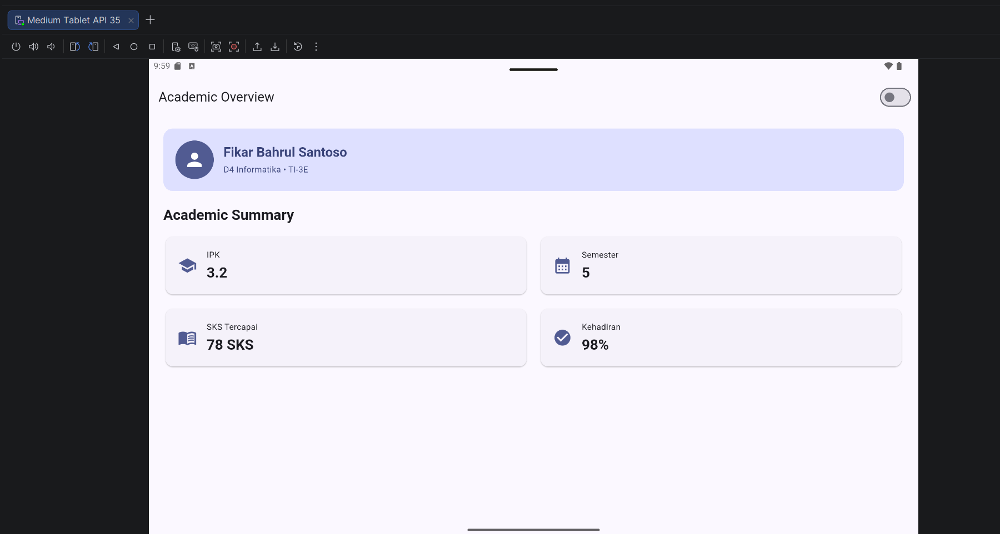

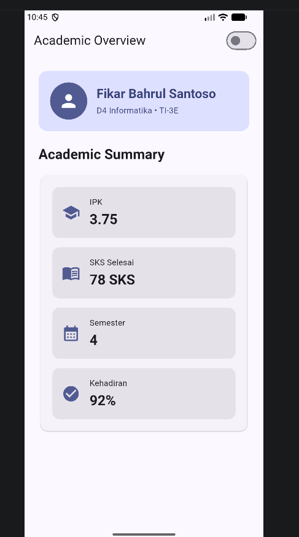

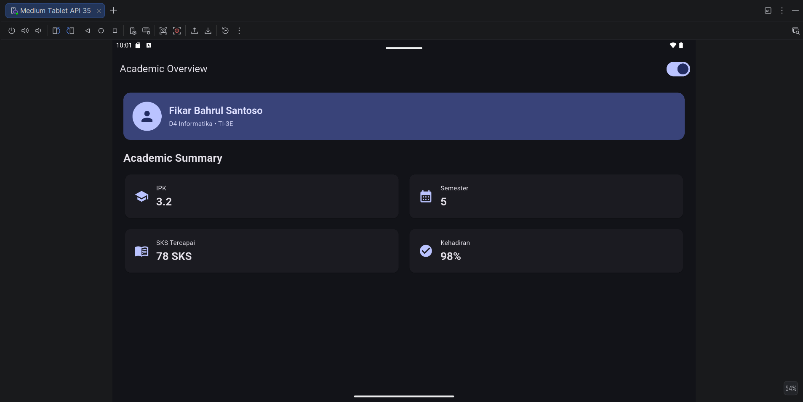

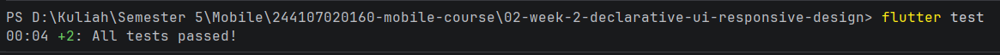

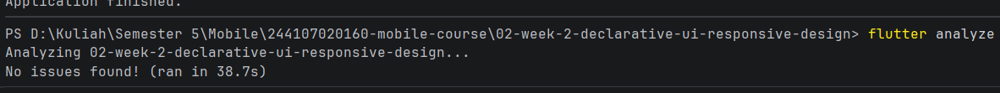

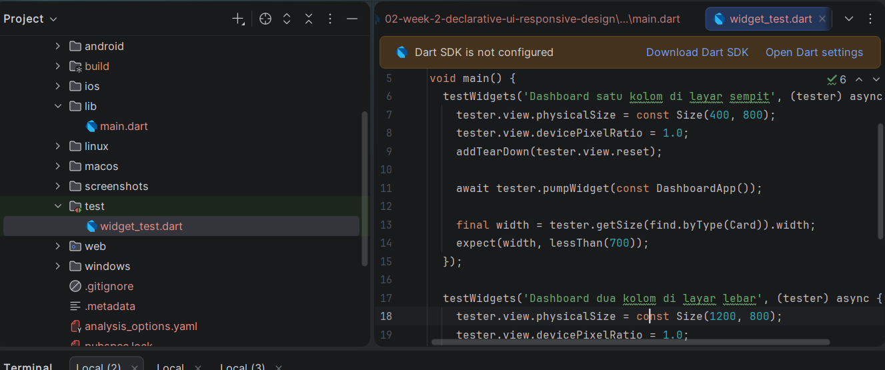

## AI Prompt Challenge

### Prompt Desain

> Bandingkan dua tata letak dashboard akademik untuk Flutter: versi `GridView` dan versi `LayoutBuilder` + `Column`. Jelaskan trade-off responsif dan aksesibilitasnya.

### Hasil dan Keputusan

`GridView` lebih praktis untuk menampilkan banyak kartu dalam bentuk grid. Namun, `LayoutBuilder` memberikan kontrol yang lebih jelas terhadap breakpoint dan jumlah kolom.

Pendekatan `LayoutBuilder` + `Column` dipilih karena lebih sesuai untuk dashboard dengan satu kolom pada layar sempit dan dua kolom pada layar lebar. Pendekatan ini juga memudahkan pengaturan header, profil, dan urutan aksesibilitas.

### Prompt Penguatan Konsep

> Jelaskan kapan penggunaan `Expanded` justru menyebabkan overflow di dalam `Row`, beri contoh kode yang gagal dan perbaikannya.

### Hasil dan Keputusan

`Expanded` dapat menyebabkan masalah apabila digunakan pada layout dengan ukuran tidak terbatas atau ketika child memiliki ukuran minimum yang terlalu besar.

`Expanded` digunakan hanya pada area yang memiliki batas ukuran jelas. Untuk kondisi tertentu, `Flexible` dapat digunakan sebagai alternatif agar child tidak dipaksa memenuhi seluruh ruang yang tersedia.

### Verification Prompt

> Periksa kembali rekomendasi layout di atas: apakah tetap responsif di bawah 600px, apakah mengurangi aksesibilitas, dan apakah ada widget yang tidak tersedia di Flutter stabil saat ini?

### Hasil Verifikasi

- Layout tetap menggunakan satu kolom pada layar di bawah `600px`.
- Informasi penting memiliki label yang bermakna.
- Widget yang digunakan tersedia pada Flutter stable.
- Tidak ada dependency tambahan yang tidak diperlukan.
- Tampilan dark theme tetap memiliki kontras yang dapat dibaca.

## Pengujian

Widget test digunakan untuk memverifikasi perilaku responsive pada ukuran layar berbeda.

File test berada di:

```text
test/responsive_dashboard_test.dart
```

Menjalankan analisis kode:

```bash
flutter analyze
```

Menjalankan widget test:

```bash
flutter test
```

Test yang dilakukan:

- Layar `400x800` menampilkan kartu dalam satu kolom.
- Layar `1200x800` menampilkan kartu dalam dua kolom.

## Checklist Verifikasi

- [Berhasil] `flutter analyze` tidak menghasilkan error atau warning baru.
- [Berhasil] `flutter test` berhasil dijalankan.
- [Berhasil] Header profil tersedia.
- [Berhasil] Minimal empat kartu informasi tersedia.
- [Berhasil] Menggunakan `Row`, `Column`, `Expanded`, dan `Container`.
- [Berhasil] Light theme dapat digunakan.
- [Berhasil] Dark theme dapat digunakan.
- [Berhasil] Toggle tema dapat digunakan.
- [Berhasil] layar sempit dan layar lebar screenshot tersimpan.

## Hasil Praktikum

Dashboard Academic Overview berhasil dibuat menggunakan Flutter. Tampilan dapat menyesuaikan ukuran layar dengan menampilkan satu kolom pada layar sempit dan dua kolom pada layar lebar.

Fitur light theme, dark theme, toggle tema, aksesibilitas, serta widget reusable berhasil diterapkan. Pengujian responsive dilakukan menggunakan widget test dengan override ukuran layar melalui `tester.view`.

## Kesimpulan

Pada praktikum minggu kedua, saya berhasil memahami penerapan declarative UI dan responsive design pada Flutter. Saya juga berhasil membuat dashboard akademik dengan layout adaptif, dukungan tema terang dan gelap, aksesibilitas, widget reusable, serta pengujian responsive.
