# Week 3 — Navigation & State Management

| Identitas Mahasiswa | Keterangan |
|---|---|
| **Nama** | Fikar Bahrul Santoso |
| **NIM** | 244107020160 |
| **Mata Kuliah** | Pemrograman Mobile |

## Tentang Project

Project ini merupakan hasil praktikum minggu ketiga Pemrograman Mobile menggunakan Flutter. Aplikasi dikembangkan dengan konsep navigasi declaratif menggunakan GoRouter dan state management menggunakan Riverpod.

Pada praktikum ini, fokus utama adalah memahami cara berpindah antar halaman dengan route, menjaga state aplikasi secara global, serta menangani state async dengan `AsyncValue` untuk kondisi loading, error, dan success.

## Fitur

Aplikasi menampilkan beberapa fitur utama:

- Halaman **Home** berisi daftar tugas
- Halaman **Detail** untuk melihat detail tugas dan mengubah status selesai
- Halaman **Statistik** yang menampilkan data simulasi async
- Navigasi multi-page menggunakan GoRouter
- State dikelola dengan `Notifier` dari Riverpod
- UI menggunakan `ConsumerWidget`
- Simulasi loading, error, dan success pada state async
- Minimal satu test yang memvalidasi perilaku state todo

## Teknologi yang Dipakai

| Teknologi | Penggunaan |
|---|---|
| Flutter | Framework aplikasi |
| Dart | Bahasa pemrograman |
| GoRouter | Navigasi multi-page dan route deklaratif |
| Riverpod | Manajemen state aplikasi |
| AsyncValue | State loading, error, dan success |
| Visual Studio Code | Menulis dan mengedit kode |
| Android Studio | Android SDK dan Emulator |
| Git | Version control |

## Menjalankan Project

Pastikan Flutter, Android SDK, dan emulator sudah terpasang dan dapat digunakan.

Masuk ke folder project:

```bash
cd 03-week-3-navigation-state-management
```

Install dependency:

```bash
flutter pub get
```

Jalankan aplikasi:

```bash
flutter run
```

Jika ingin menjalankan ke emulator tertentu:

```bash
flutter devices
flutter run -d <device-id>
```

## Praktikum 1 — Navigasi dengan GoRouter

Pada praktikum ini, aplikasi dibangun dengan route yang terstruktur agar halaman dapat diakses dengan URL yang jelas.

Fitur yang diterapkan:

1. `GoRoute` untuk halaman home
2. `GoRoute` untuk detail tugas dengan parameter dinamis
3. `GoRoute` untuk halaman statistik
4. `context.go()` dan `context.push()` untuk perpindahan halaman

Konsep utama yang dipelajari adalah bahwa aplikasi tidak hanya mengandalkan stack navigation manual, tetapi menggunakan routing deklaratif yang lebih mudah dikelola untuk aplikasi dengan lebih banyak halaman.

## Praktikum 2 — State Management dengan Riverpod

State aplikasi dikelola dengan Riverpod agar data todo bisa digunakan bersama antar halaman tanpa prop drilling.

Komponen yang dipakai:

- `ProviderScope` di root aplikasi
- `Notifier` dan `NotifierProvider` untuk state todo
- `ConsumerWidget` untuk widget yang membaca state
- `ref.watch()` untuk UI yang mengikuti state
- `ref.read()` untuk aksi seperti tambah, toggle, atau hapus tugas

Dengan pendekatan ini, UI selalu dibangun berdasarkan state yang ada, sehingga perubahan data langsung terlihat di layar.

## Praktikum 3 — AsyncValue: loading, error, success

Pada halaman statistik, data disimulasikan menggunakan proses async.

State yang diimplementasikan:

- `loading` saat data sedang diproses
- `error` saat simulasi gagal
- `success` saat data berhasil diambil

Pola ini diterapkan dengan `AsyncValue.when(...)` sehingga UI bisa menampilkan tampilan yang sesuai dengan kondisi data tersebut.

## AI Prompt Challenge

### Prompt Desain

> Buatkan aplikasi ToDo dengan navigasi dan Riverpod. Jelaskan perbedaan antara route dengan GoRouter dan Navigator 1.0 serta bagaimana state management membantu saat data dibagikan antar halaman.

### Hasil dan Keputusan

GoRouter lebih rapi untuk aplikasi multi-page karena route didefinisikan secara deklaratif dan dapat diakses langsung melalui URL. Navigator 1.0 lebih cocok untuk navigasi sederhana, tetapi sulit dikelola saat proyek makin besar.

Riverpod dipilih karena state tidak terikat pada `BuildContext`, lebih mudah di test, dan cocok untuk aplikasi yang punya data yang dibagikan antar halaman.

### Prompt Penguatan Konsep

> Jelaskan alasan `ref.watch()` dan `ref.read()` memiliki perilaku yang berbeda, serta kapan masing-masing digunakan.

### Hasil dan Keputusan

`ref.watch()` dipakai saat widget harus membangun ulang ketika data berubah. Sementara `ref.read()` dipakai saat event seperti tombol klik atau aksi tertentu hanya perlu dibaca sekali.

### Prompt Verifikasi

> Periksa apakah aplikasi sudah menggunakan route dan provider sesuai materi minggu 3, serta apakah state async ditampilkan dengan benar.

### Hasil Verifikasi

- Route untuk halaman home, detail, dan statistik sudah tersedia.
- State todo dikelola di provider yang terpisah dari UI.
- `AsyncValue` sudah menangani kondisi loading, error, dan success.
- Aplikasi sudah diuji menggunakan unit/widget test.

## Screenshot

Berikut beberapa hasil screenshot yang merepresentasikan hasil praktikum dengan format penamaan sesuai pola proyek:

### Praktikum 1

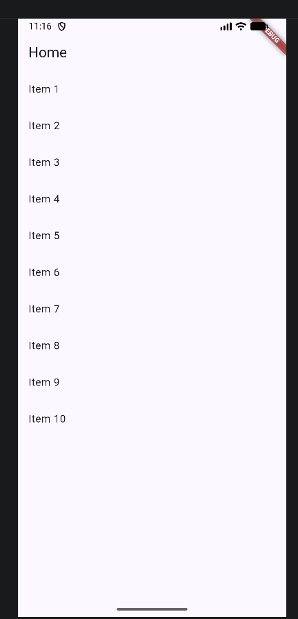

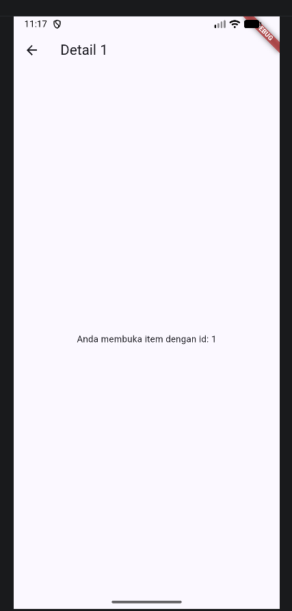

### Praktikum 2

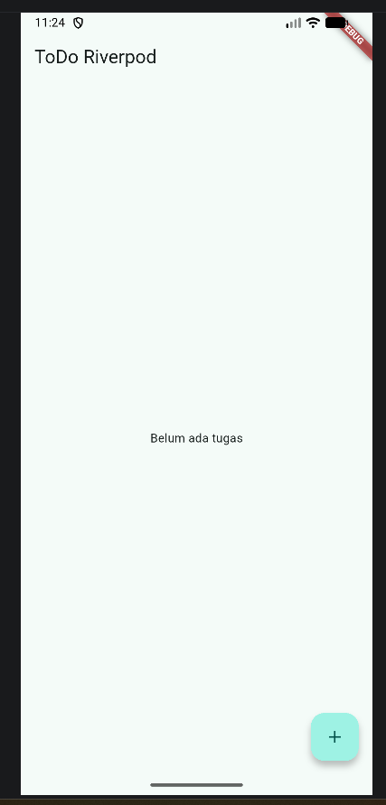

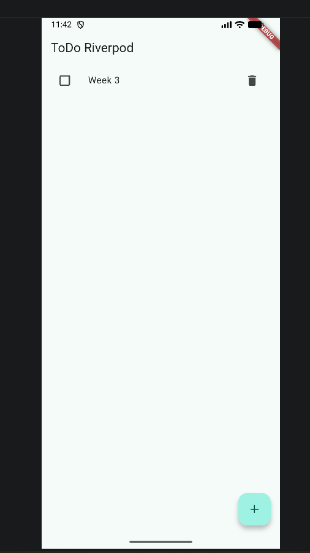

### Praktikum 3

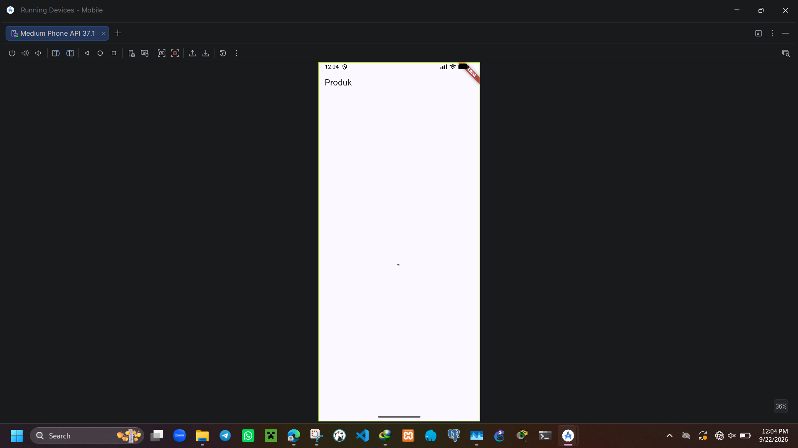

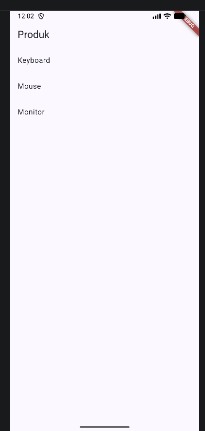

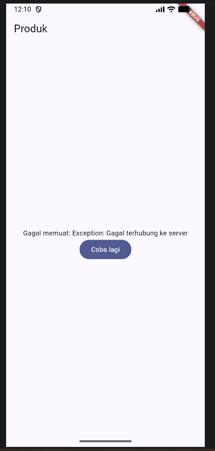

### Testing

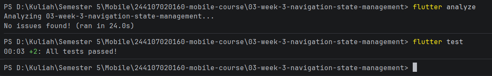

### Tugas

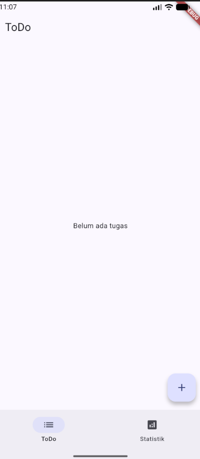

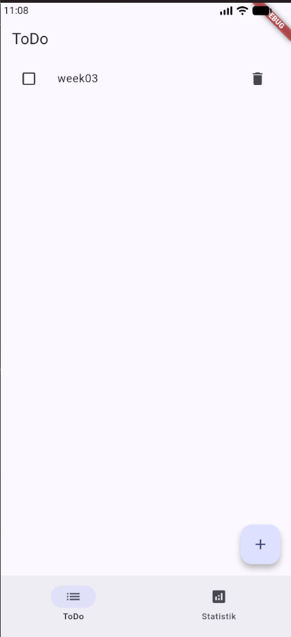

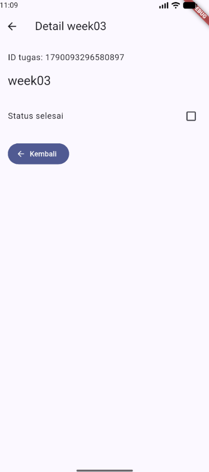

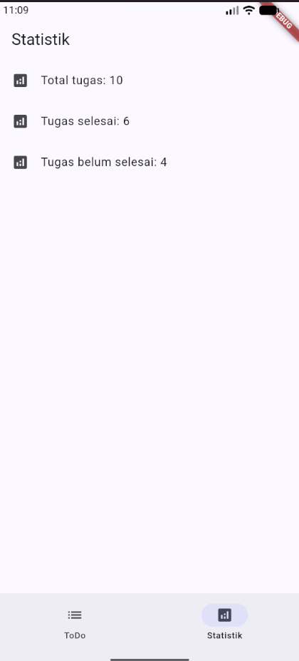

## Pengujian

File test berada di:

```text
test/widget_test.dart
```

Menjalankan analisis kode:

```bash
flutter analyze
```

Menjalankan widget test:

```bash
flutter test
```

Test yang dilakukan:

- Menambahkan todo baru
- Memastikan todo baru masuk ke provider
- Filter tugas yang belum selesai

## Checklist Verifikasi

- [Berhasil] `flutter analyze` berhasil dijalankan.
- [Berhasil] `flutter test` berhasil dijalankan.
- [Berhasil] Terdapat minimal 2 halaman dengan GoRouter.
- [Berhasil] State todo dikelola dengan Riverpod dan `Notifier`.
- [Berhasil] UI memakai `ConsumerWidget`.
- [Berhasil] AsyncValue menampilkan loading, error, dan success.
- [Berhasil] Minimal satu test lulus.

## Hasil Praktikum

Aplikasi ToDo dengan navigasi dan state management berhasil dibuat menggunakan Flutter. Fitur daftar tugas, halaman detail, dan statistik dapat berjalan dengan baik, serta state disimpan dan dikelola di provider yang tepat.

## Kesimpulan

Pada praktikum minggu ketiga, saya berhasil memahami cara kerja navigasi dengan GoRouter dan state management dengan Riverpod. Saya juga berhasil menerapkan `AsyncValue` untuk mengelola kondisi loading, error, dan success secara benar. Hasilnya aplikasi lebih terstruktur, lebih mudah dikelola, dan lebih siap untuk dikembangkan pada proyek yang lebih kompleks.
