# Week 4 — Networking & REST API

| Identitas Mahasiswa | Keterangan |
|---|---|
| **Nama** | Fikar Bahrul Santoso |
| **NIM** | 244107020160 |
| **Mata Kuliah** | Pemrograman Mobile |

## Tentang Project

Project ini merupakan hasil praktikum minggu keempat Pemrograman Mobile menggunakan Flutter. Aplikasi mengambil data post dari JSONPlaceholder melalui REST API, kemudian menampilkannya dengan repository pattern, Dio, dan Riverpod.

Fokus praktikum adalah memahami request HTTP, parsing JSON aman null, pemisahan UI dan repository, penanganan loading/error/empty/success, serta pagination dengan infinite scroll.

## Fitur

- Mengambil data post dari JSONPlaceholder melalui Dio
- Repository pattern agar UI tidak memanggil Dio secara langsung
- Model `Post` dengan `fromJson` aman null
- Loading, error dengan retry, empty, dan success state
- Pagination 10 item per halaman dengan infinite scroll
- Guard `isLoadingMore` untuk mencegah request ganda
- Pesan error ramah pengguna untuk timeout, koneksi, 404, dan 500
- Detail post melalui GoRouter pada route `/post/:id`
- Unit test model, error mapping, provider, dan widget

## Teknologi yang Dipakai

| Teknologi | Penggunaan |
|---|---|
| Flutter | Framework aplikasi |
| Dart | Bahasa pemrograman |
| Dio | HTTP client dan interceptor |
| Riverpod | State management dan dependency injection |
| GoRouter | Navigasi halaman detail |
| JSONPlaceholder | REST API dummy |
| Android Studio | Android SDK dan emulator |

## Menjalankan Project

Masuk ke folder project:

```bash
cd 04-week-4-networking-rest-api
```

Install dependency dan jalankan aplikasi:

```bash
flutter pub get
flutter run
```

Untuk emulator tertentu:

```bash
flutter devices
flutter run -d <device-id>
```

## Praktikum 1 — Dio dan Model Data

Pada praktikum pertama, aplikasi menggunakan `api_client.dart` untuk memusatkan `baseUrl`, timeout 10 detik, header JSON, dan logging interceptor. Data JSON dari endpoint `/posts` dipetakan ke model `Post` melalui `Post.fromJson`.

Repository menjadi pintu data satu-satunya. UI hanya membaca state dari provider dan tidak memanggil Dio secara langsung.

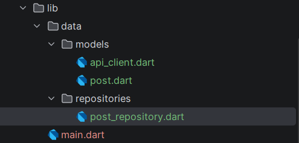

## Praktikum 2 — Provider dan Error Handling

Provider Riverpod menghubungkan Dio dengan repository. Error dari repository diteruskan menjadi state error dan dipetakan oleh `friendlyErrorMessage` menjadi pesan yang mudah dipahami pengguna.

State yang ditampilkan:

- Loading saat request berlangsung
- Error dengan tombol `Coba lagi`
- Empty ketika server mengembalikan daftar kosong
- Success ketika daftar post berhasil ditampilkan

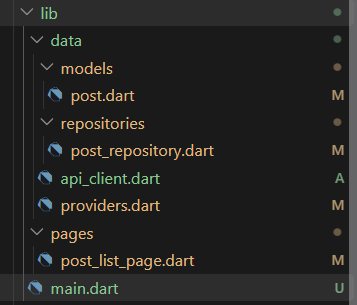

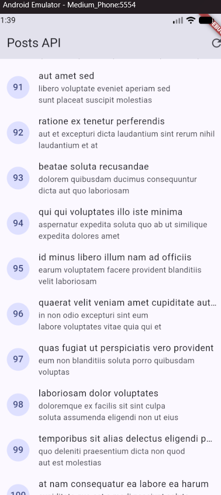

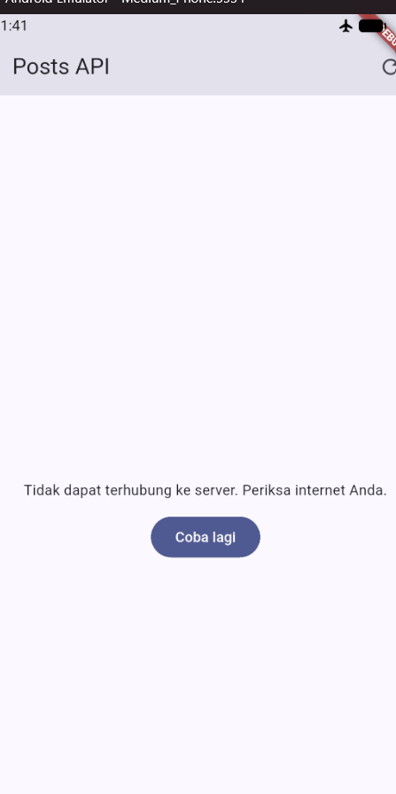

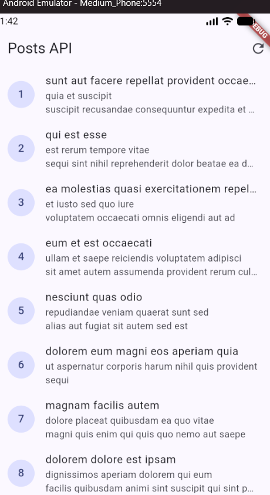

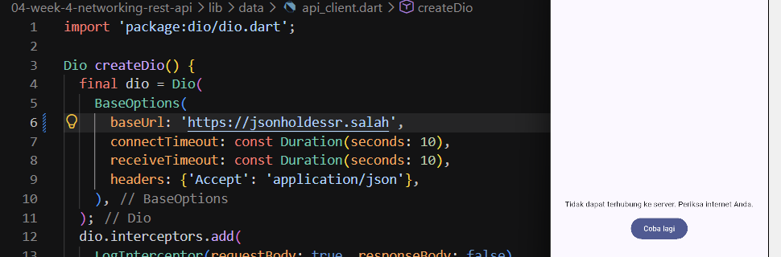

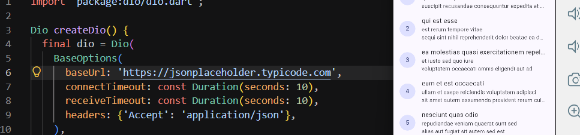

## Praktikum 3 — Pagination Dasar

Pagination menggunakan query `_page` dan `_limit` dengan 10 item per halaman. `ScrollController` memanggil `loadNextPage()` ketika posisi scroll mendekati akhir daftar.

Guard berikut mencegah request ganda dan menghentikan request setelah data habis:

```dart
if (state.isLoadingMore || !state.hasMore) return;
```

Jika halaman berikutnya gagal, data lama tetap ditampilkan bersama pesan error dan tombol retry.

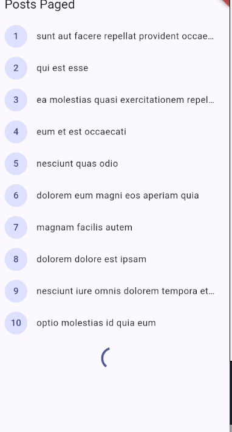

## Refactoring dan Testing

Refactoring dilakukan dengan memindahkan pemetaan pesan error ke `network_errors.dart`, menambahkan detail post dengan GoRouter, serta menyediakan `fetchPost(id)` untuk route `/post/:id`.

Test memakai repository palsu agar tidak bergantung pada internet. Kasus yang diuji meliputi parsing field hilang/null, pemetaan error Dio, provider sukses/error, dan widget aplikasi.

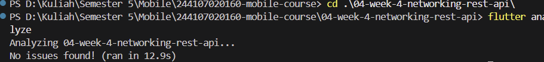

## Tugas

Implementasi tugas menggabungkan REST API, Dio terpusat, repository, Riverpod, empat state UI, pagination, detail post, dan testing. Hasil akhir sudah dapat dijalankan pada emulator Android.

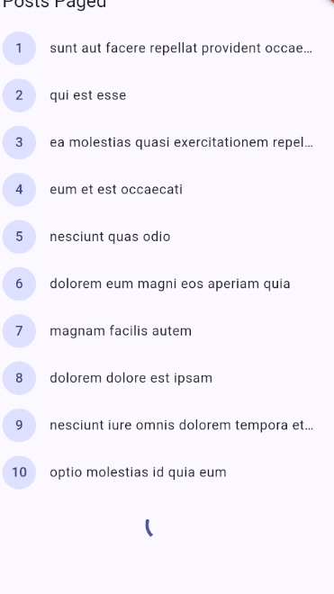

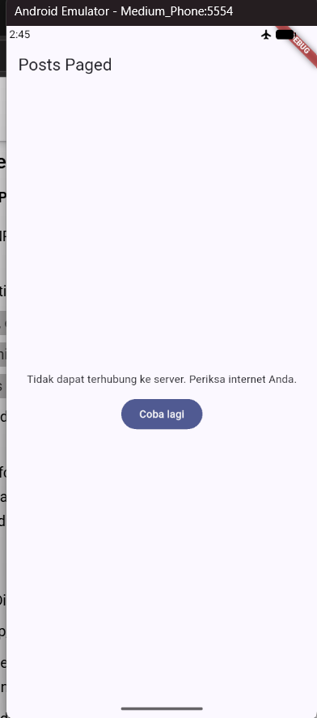

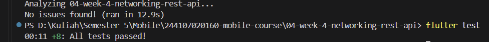

## AI Prompt Challenge

Dokumentasi prompt, hasil implementasi, perbaikan, dan verifikasi tersedia di [docs/AI_Prompt_Challenge.md](docs/AI_Prompt_Challenge.md).

## Pengujian

Menjalankan analisis kode dan seluruh test:

```bash
flutter analyze
flutter test
```

Hasil verifikasi terakhir:

- `flutter analyze`: lulus tanpa issue
- `flutter test`: 8 test lulus

Test utama berada di:

- `test/comment_test.dart` untuk model Comment dan error mapping
- `test/post_test.dart` untuk provider dengan repository palsu
- `test/widget_test.dart` untuk smoke test halaman pagination

## Refleksi

### Mengapa UI dilarang memanggil Dio langsung?

Karena UI seharusnya hanya mengatur tampilan dan interaksi. Jika UI memanggil Dio langsung, kode tampilan menjadi bergantung pada detail jaringan, sulit diuji, dan sulit digunakan kembali. Repository membuat akses data lebih terpusat dan dapat diganti dengan repository palsu saat testing.

### Kapan pagination client-side cukup?

Pagination client-side cukup untuk data yang kecil dan sudah tersedia di memori. Untuk data yang besar, pagination server dengan `_page` dan `_limit` lebih efisien karena aplikasi hanya menerima data yang sedang diperlukan.

### Bagaimana exception berubah menjadi AsyncError?

`AsyncNotifier` menjalankan method `build()` secara asynchronous. Jika repository melempar exception, Riverpod menangkapnya dan mengubah state provider menjadi `AsyncError`. `try/catch` eksplisit tetap diperlukan ketika aplikasi perlu mempertahankan data lama, membuat fallback, atau menampilkan retry khusus seperti pada pagination.

### Bagian mana yang diperbaiki dari hasil AI?

Perbaikan yang dilakukan meliputi penyesuaian provider dengan Riverpod 3, pemetaan tipe error Dio secara lengkap, perbaikan import, test widget agar memakai `ProviderScope`, penanganan error pagination agar tidak menampilkan spinner tanpa akhir, serta state empty yang dibedakan dari loading.

## Checklist Verifikasi

- [Berhasil] UI mengakses data melalui repository dan provider.
- [Berhasil] Dio memiliki base URL, timeout, dan interceptor terpusat.
- [Berhasil] Model menggunakan parsing aman null.
- [Berhasil] Loading, error + retry, empty, dan success tersedia.
- [Berhasil] Pagination menggunakan 10 item per halaman.
- [Berhasil] Guard request ganda menggunakan `isLoadingMore`.
- [Berhasil] Detail post tersedia melalui GoRouter `/post/:id`.
- [Berhasil] `flutter analyze` lulus tanpa issue.
- [Berhasil] `flutter test` lulus dengan 8 test.

## Kesimpulan

Pada praktikum minggu keempat, saya berhasil menerapkan komunikasi REST API menggunakan Dio dan JSONPlaceholder. Data dipisahkan melalui repository, dikelola menggunakan Riverpod, dan ditampilkan dengan state loading, error, empty, serta success. Pagination dan halaman detail juga berhasil ditambahkan, kemudian seluruh implementasi diverifikasi menggunakan analyzer dan test Flutter.
