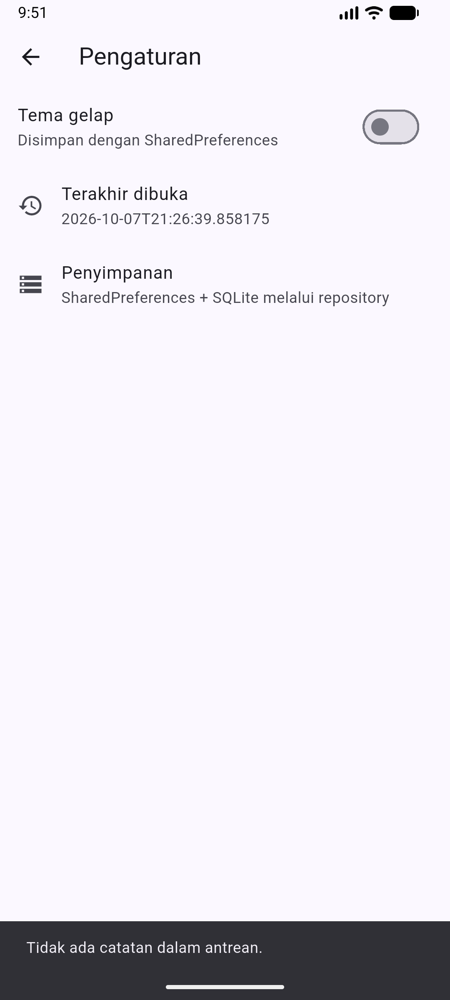
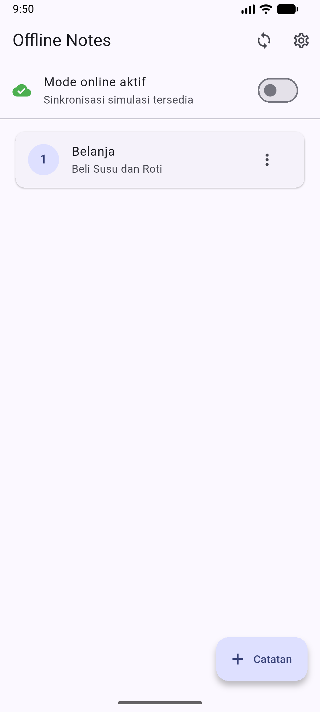
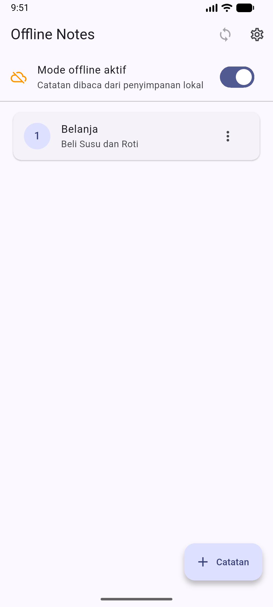
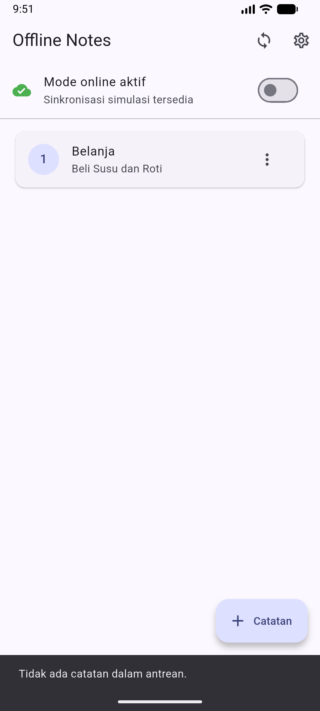

# Week 5 — Local Storage & Offline First

| Identitas Mahasiswa | Keterangan |
|---|---|
| **Nama** | Fikar Bahrul Santoso |
| **NIM** | 244107020160 |
| **Mata Kuliah** | Pemrograman Mobile |

## Tentang Project

Project ini merupakan aplikasi **Offline Notes** untuk praktikum minggu kelima Pemrograman Mobile. Aplikasi menyimpan preferensi tema dengan SharedPreferences, menyimpan catatan secara persisten dengan SQLite, dan menyediakan simulasi offline-first dengan antrean sinkronisasi.

## Fitur

- Toggle tema gelap/terang dengan SharedPreferences
- Penyimpanan waktu terakhir dibuka
- CRUD catatan melalui repository SQLite
- Urutan catatan berdasarkan `updated_at` terbaru
- Badge `dirty` untuk catatan yang belum tersinkron
- Mode offline untuk membaca dan menulis catatan tanpa jaringan
- Sinkronisasi simulasi yang mengubah catatan dirty menjadi bersih
- Cache-first untuk data posts JSONPlaceholder
- Provider Riverpod dengan state loading, error, empty, dan success
- Test model, repository palsu, provider, dan widget

## Teknologi yang Dipakai

| Teknologi | Penggunaan |
|---|---|
| Flutter | Framework aplikasi |
| Dart | Bahasa pemrograman |
| Riverpod | State management dan dependency injection |
| SharedPreferences | Preferensi tema dan waktu terakhir dibuka |
| SQLite melalui sqflite | Penyimpanan catatan dan cache posts |
| Dio | Refresh data posts di background |
| Android Emulator | Perangkat uji Medium Phone |

## Struktur Project

```text
05-week-5-local-storage-offline-first/
├── README.md
├── docs/
├── screenshots/
└── week5_offline_notes/
    ├── lib/
    └── test/
```

## Menjalankan Project

Masuk ke folder project:

```bash
cd 05-week-5-local-storage-offline-first/week5_offline_notes
flutter pub get
flutter run
```

Untuk emulator tertentu:

```bash
flutter devices
flutter run -d emulator-5554
```

## Praktikum 1 — SharedPreferences

`PrefsRepository` memusatkan akses key-value untuk `dark_mode` dan `last_opened_at`. Halaman Pengaturan menyediakan toggle tema dan menampilkan waktu terakhir aplikasi dibuka. UI membaca provider, bukan memanggil SharedPreferences secara langsung.



## Praktikum 2 — SQLite dan Repository Catatan

Model `Note` memiliki `id`, `title`, `body`, `updatedAt`, dan `dirty`. `NoteRepository` menjadi satu-satunya pintu untuk operasi tambah, baca, ubah, hapus, menghitung dirty, dan menandai catatan sudah tersinkron.




## Praktikum 3 — Cache-first dan Antrean Sync

Saat mode offline aktif, catatan tetap dibaca dari SQLite dan catatan baru diberi `dirty = 1`. Saat mode online dipilih, tombol sinkronisasi menjalankan simulasi upload dengan delay, kemudian mengubah semua dirty flag menjadi `0` setelah proses berhasil.

Untuk data bacaan, `loadPostsCacheFirst` membaca tabel `cached_posts` lebih dahulu, lalu melakukan refresh JSONPlaceholder di background ketika mode offline tidak dipaksa.





Aturan konflik yang digunakan adalah **last-write-wins** berdasarkan `updated_at`. Implementasi ini belum memiliki backend tulis sungguhan, sehingga sinkronisasi catatan masih disimulasikan secara lokal.

## AI Challenge

Prompt, perbandingan storage, keputusan teknis, dan verifikasi hasil AI tersedia di [docs/AI_Prompt_Challenge.md](docs/AI_Prompt_Challenge.md).

Keputusan akhir:

- SharedPreferences untuk preferensi kecil berbentuk key-value.
- SQLite untuk koleksi catatan karena mendukung query, update parsial, `dirty`, dan `updated_at`.
- Hive dan Drift dipertimbangkan sebagai alternatif, tetapi tidak dipakai agar sesuai dengan Jobsheet.

## Testing

Menjalankan analisis kode dan seluruh test:

```bash
dart format lib test
flutter analyze
flutter test
```

Test mencakup:

- Mapping `Note.fromMap` ketika field hilang
- Persistensi `dirty` melalui `toMap` dan `fromMap`
- Provider dengan repository palsu
- Error repository palsu
- Smoke test halaman Offline Notes

## Refleksi

### Mengapa daftar catatan tidak disimpan di SharedPreferences?

SharedPreferences cocok untuk nilai primitif kecil, bukan koleksi yang sering dicari, diubah sebagian, dan disinkronkan. SQLite lebih sesuai karena catatan memiliki kolom, query, `updated_at`, dan `dirty`.

### Kapan cache-first cukup?

Cache-first sesuai untuk data yang boleh ditampilkan dari salinan lokal terlebih dahulu, seperti daftar bacaan. Untuk harga real-time atau data yang wajib terbaru, network-first lebih tepat.

### Bagaimana dirty flag menjadi antrean sync?

Setiap perubahan lokal diberi `dirty = 1`. Saat koneksi tersedia, repository menghitung catatan dirty, menjalankan proses sync berurutan, lalu memberi `dirty = 0` hanya setelah sync berhasil. Pada aplikasi besar, tabel outbox terpisah lebih tepat untuk menyimpan operasi tambah, ubah, dan hapus.

### Bagian mana dari rekomendasi AI yang ditolak?

Daftar catatan tidak ditempatkan di SharedPreferences karena akan menjadi satu string besar yang sulit di-query dan diperbarui sebagian. Kombinasi SharedPreferences dan SQLite dipilih karena paling sesuai dengan kebutuhan praktikum.

## Checklist Verifikasi

- [Berhasil] Struktur project dan dependency mengikuti Jobsheet
- [Berhasil] UI tidak mengakses storage secara langsung
- [Berhasil] SharedPreferences terpusat pada `PrefsRepository`
- [Berhasil] CRUD catatan terpusat pada `NoteRepository`
- [Berhasil] Dirty flag dan simulasi sync tersedia
- [Berhasil] Cache-first tersedia untuk posts
- [Berhasil] `flutter analyze` lulus
- [Berhasil] `flutter test` lulus
- [Berhasil] Screenshot emulator Medium Phone diperbarui setelah alur demo selesai

## Kesimpulan

Pada praktikum minggu kelima, aplikasi Offline Notes berhasil menerapkan penyimpanan key-value dengan SharedPreferences, CRUD catatan dengan SQLite melalui repository, serta konsep offline-first menggunakan cache lokal, dirty flag, dan simulasi sinkronisasi. Seluruh kode dipisahkan dari UI melalui provider Riverpod dan diverifikasi dengan test model, repository palsu, serta widget.