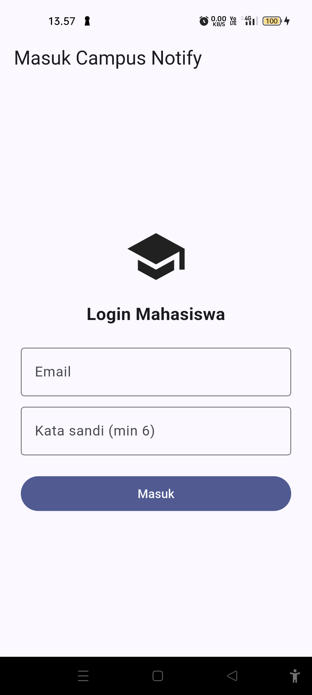
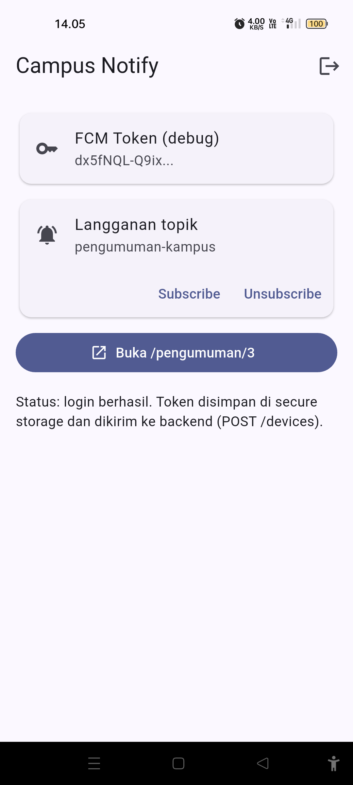
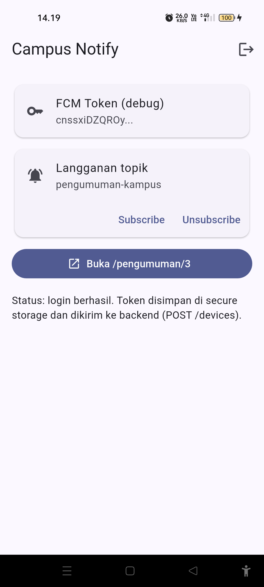
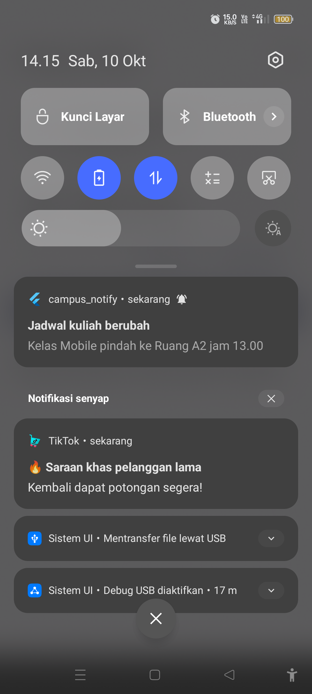
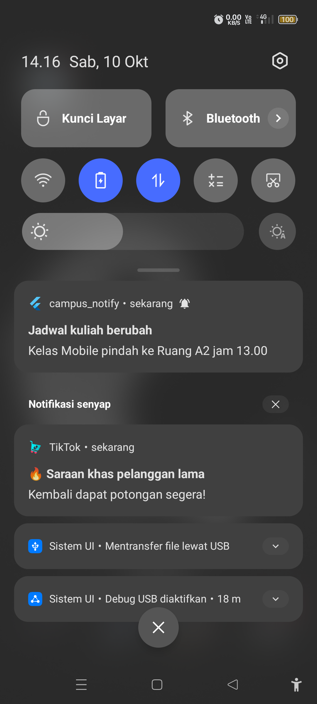
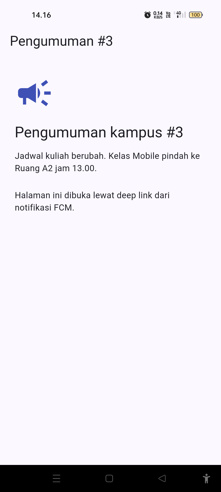
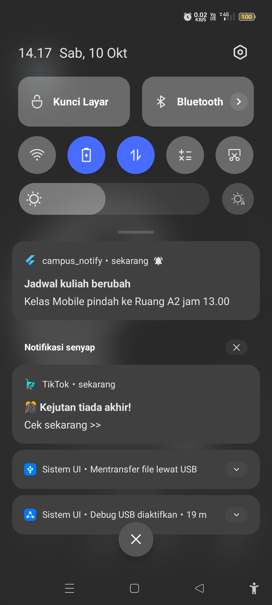
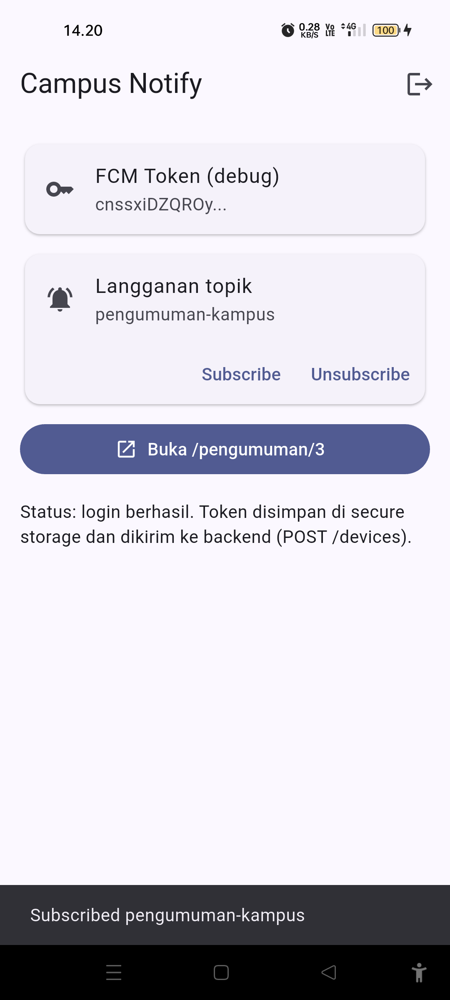

# Week 6 — Authentication, Security & FCM

| Identitas Mahasiswa | Keterangan |
|---|---|
| **Nama** | Fikar Bahrul Santoso |
| **NIM** | 244107020160 |
| **Mata Kuliah** | Pemrograman Mobile |

## Tentang Project

Project ini merupakan aplikasi **Campus Notify** untuk praktikum minggu keenam
Pemrograman Mobile. Aplikasi menerapkan alur autentikasi dengan penyimpanan token
yang aman, refresh token otomatis pada Dio, serta integrasi Firebase Cloud
Messaging (FCM) untuk notifikasi pengumuman kampus pada tiga app state.

## Fitur

- Login (mock) dengan guard route: belum login selalu diarahkan ke `/login`
- Token disimpan di `flutter_secure_storage`, bukan SharedPreferences
- Dio otomatis melakukan refresh sekali saat menerima `401`, dan logout bila refresh mati
- FCM: permission, `getToken`, dan `onTokenRefresh` dikirim ke backend (`POST /devices`)
- Foreground menampilkan banner manual via `flutter_local_notifications`
- Deep link klik notifikasi ke `/pengumuman/:id` di tiga app state
- Topik `pengumuman-kampus` untuk broadcast: subscribe dan unsubscribe
- Token ditampilkan terpotong pada layar debug (12 karakter pertama)
- Refactoring: `lib/routes.dart`, `routeFromMessage`, dan `lib/data/api_errors.dart`
- Test unit parsing route, logika sesi, dan smoke test widget

## Teknologi yang Dipakai

| Teknologi | Penggunaan |
|---|---|
| Flutter | Framework aplikasi |
| Dart | Bahasa pemrograman |
| Riverpod | State management dan dependency injection |
| GoRouter | Navigasi, guard route, dan deep link |
| Dio | HTTP client dan interceptor refresh token |
| flutter_secure_storage | Penyimpanan access & refresh token |
| firebase_messaging | Penerimaan notifikasi FCM |
| flutter_local_notifications | Banner manual saat foreground |
| Firebase (FCM HTTP v1) | Pengiriman pesan uji dari Cloud Messaging |
| Android — Oppo Reno 7z 5G | Perangkat uji fisik via USB debugging |

## Struktur Project

```text
06-week-6-authentication-security-fcm/
├── README.md
├── docs/
│   └── AI_Prompt_Challenge.md
├── screenshots/
├── lib/
│   ├── data/
│   ├── messaging/
│   ├── pages/
│   ├── providers/
│   ├── main.dart
│   └── routes.dart
└── test/
```

## Menjalankan Project

Masuk ke folder project:

```bash
cd 06-week-6-authentication-security-fcm/
flutter pub get
flutter run
```

Perangkat fisik yang dipakai: Oppo Reno 7z 5G (`CPH2343`) melalui USB debugging.

## Praktikum 1 — Login, Secure Storage, dan Token Refresh

`TokenStore` menjadi satu-satunya pintu keluar-masuk token. `AuthRepository`
(mock) meniru penerbitan access + refresh token. `buildApiClient` menambahkan
header `Authorization: Bearer ...` dan, saat menerima `401`, mencoba refresh
sekali lalu mengulang request.



Setelah login, token tersimpan di secure storage dan aplikasi masuk ke Home.



## Praktikum 2 — FCM, Permission, dan Token Lifecycle

`PushService` meminta izin notifikasi, mengambil token dengan
`FirebaseMessaging.instance.getToken()`, memantau `onTokenRefresh` (dikirim ke
`POST /devices` melalui Dio), dan berlangganan topik `pengumuman-kampus`.
Token hanya ditampilkan terpotong di layar debug.

Untuk membuktikan lifecycle token, aplikasi di-reinstall (data dihapus) lalu
login kembali. Token berubah dari `dx5fNQL-Q9ix...` menjadi `cnsxsiDZQRQy...`.



## Praktikum 3 — Payload, Tiga App State, Klik dan Topik

Pesan uji dikirim lewat FCM HTTP v1 dengan payload gabungan
`notification + data`, target topik `pengumuman-kampus`:

```json
{
  "message": {
    "topic": "pengumuman-kampus",
    "notification": { "title": "Jadwal kuliah berubah", "body": "Kelas Mobile pindah ke Ruang A2 jam 13.00" },
    "data": { "route": "/pengumuman/3", "id": "3" }
  }
}
```

### Matriks pengujian tiga app state

| State | Yang diharapkan | Cara uji | Hasil |
|---|---|---|---|
| Foreground | Banner lokal muncul, klik masuk `/pengumuman/3` | Aplikasi terbuka, kirim dari FCM API | [Berhasil] |
| Background | Banner sistem muncul, klik masuk rute benar | Tekan Home, kirim, klik banner | [Berhasil] |
| Terminated | Aplikasi terbuka ke rute benar via `getInitialMessage` | Tutup aplikasi, kirim, klik banner | [Berhasil] |

Foreground: banner lokal muncul dan klik menuju halaman pengumuman.




Background: banner sistem muncul dan klik menuju rute yang benar.





Terminated: banner sistem muncul; klik membuka aplikasi langsung ke rute tujuan.




### Topic messaging

Topik dipakai untuk broadcast (semua mahasiswa). Tombol subscribe/unsubscribe
tersedia di Home.



## Keputusan Keamanan

- Refresh token hanya disimpan di `flutter_secure_storage`, tidak di SharedPreferences.
- Token tidak di-hardcode di kode Dart dan tidak dicetak penuh ke log.
- Refresh hanya lewat body POST HTTPS, tidak lewat query URL.

## AI Challenge

Prompt, ringkasan output awal AI, daftar perbaikan manual, checklist verifikasi,
dan tabel hasil uji tiga app state tersedia di
[docs/AI_Prompt_Challenge.md](docs/AI_Prompt_Challenge.md).

## Testing

```bash
dart format lib test
flutter analyze
flutter test
```

Test mencakup:

- `routeFromMessage` menangani route kosong dan tanpa slash
- Data payload membawa id pengumuman
- Status login dibaca dari token
- Refresh gagal memaksa login ulang
- Smoke test halaman pengumuman

## Refleksi

### Mengapa refresh token tidak boleh disimpan di SharedPreferences?

SharedPreferences tidak terenkripsi, sehingga isinya bisa dibaca dari backup atau
perangkat yang di-root. Refresh token berumur panjang, jadi bila bocor, penyerang
bisa menerbitkan access token baru tanpa login. Karena itu token hanya disimpan
di `flutter_secure_storage` (Keychain/Keystore).

### Apa yang rusak bila `onTokenRefresh` diabaikan selama satu semester?

Backend akan menyimpan token basi. Setelah reinstall, clear data, atau rotasi
token oleh Firebase, pesan yang dikirim ke token lama tidak terkirim, sehingga
pengguna berhenti menerima pengumuman tanpa error yang terlihat.

### Kapan memakai topik dan kapan memakai token perangkat?

Topik untuk broadcast ke banyak pengguna, misalnya pengumuman jadwal kuliah untuk
satu angkatan. Token perangkat untuk pesan personal, misalnya nilai atau tagihan
yang hanya untuk satu mahasiswa.

### Bagian mana dari draf AI yang Anda tolak atau perbaiki?

Banner foreground pada draf awal hanya menyimpan `pendingDeepLink` sehingga klik
tidak langsung navigasi. Saya tambahkan `deepLinkHandler` agar klik menuju
`data.route`. Saya juga menyesuaikan API `flutter_local_notifications` versi 22
(parameter bernama) dan menambahkan `refreshListenable` pada guard router.

## Checklist Verifikasi

- [Berhasil] Token hanya di `flutter_secure_storage`, tidak di SharedPreferences/log/screenshot penuh
- [Berhasil] `401` memicu refresh sekali lalu retry; refresh mati memaksa login ulang
- [Berhasil] Ketiga app state teruji; klik masuk ke rute yang benar
- [Berhasil] Topik untuk broadcast, token untuk pesan personal
- [Berhasil] `flutter analyze` bersih dan semua test lulus
- [Berhasil] APK terinstal dan dijalankan di device fisik Oppo Reno 7z 5G
- [Berhasil] Screenshot tersedia di `screenshots/`

## Kesimpulan

Pada praktikum minggu keenam, aplikasi Campus Notify berhasil menerapkan alur
autentikasi dengan token aman dan refresh otomatis, serta integrasi FCM untuk
notifikasi pengumuman. Klik notifikasi berhasil membuka deep link
`/pengumuman/:id` pada state foreground, background, dan terminated. Token
terbukti diperbarui setelah reinstall, dan pengujian dilakukan langsung pada
perangkat fisik.